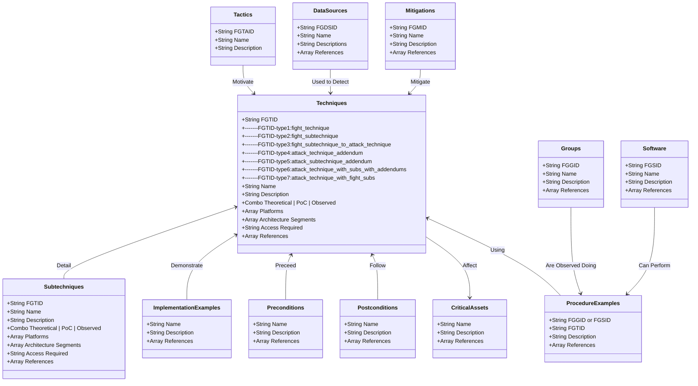

```mermaid
classDiagram
    Tactics --> Techniques : Motivate
    Techniques <-- Subtechniques : Detail
    Techniques <-- Implementation Examples : Demonstrate
    Techniques <-- Preconditions : Preceed
    Techniques <-- Postconditions : Follow
    Techniques --> CriticalAssets : Affect
    DataSources --> Techniques : Used to Detect
    Mitigations --> Techniques : Mitigate
    Groups --> Procedure Examples : Are Observed Doing
    Software --> Procedure Examples : Can Perform
    Techniques <-- Procedure Examples : Using
    class Tactics {
        +String FGTAID
        +String Name
        +String Description
    }
    class Techniques {
        +String FGTID
        +-------FGTID-type1:fight_technique
        +-------FGTID-type2:fight_subtechnique
        +-------FGTID-type3:fight_subtechnique_to_attack_technique
        +-------FGTID-type4:attack_technique_addendum
        +-------FGTID-type5:attack_subtechnique_addendum
        +-------FGTID-type6:attack_technique_with_subs_with_addendums
        +-------FGTID-type7:attack_technique_with_fight_subs
        +String Name
        +String Description
        +Combo Theoretical | PoC | Observed
        +Array Platforms
        +Array Architecture Segments
        +String Access Required
        +Array References
    }
    class Subtechniques{
        +String FGTID
        +String Name
        +String Description
        +Combo Theoretical | PoC | Observed
        +Array Platforms
        +Array Architecture Segments
        +String Access Required
        +Array References
    }
    class Mitigations{
        +String FGMID
        +String Name
        +String Description
        +Array References
    }
    class DataSources{
        +String FGDSID
        +String Name
        +String Descriptions
        +Array References
    }
    class Groups{
        +String FGGID
        +String Name
        +String Description
        +Array References
    }
    class Software{
        +String FGSID
        +String Name
        +String Description
        +Array References
    }
    class Implementation Examples{
        +String Name
        +String Description
        +Array References
    }
    class Procedure Examples {
        +String FGGID or FGSID
        +String FGTID
        +String Description
        +Array References 
    }
    class Preconditions{
        +String Name
        +String Description
        +Array References
    }
    class Postconditions{
        +String Name
        +String Description
        +Array References
    }
    class Critical Assets{
        +String Name
        +String Description
        +Array References
    }
```
